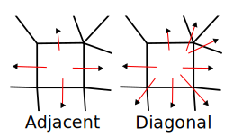

# Diagonal Grids

By default, all Sylves grids only consider edge-to-edge adjacencies. That is, methods like `Move`, `GetNeighbours` etc will only return cells that share an edge with the input cell.

This is usually all that is needed, as you can find any diagonal via two steps in the grid. But sometimes it's convenient to have a grid that directly represents connections between diagonal cells. 

You can use [`IGrid.GetDiagonalGrid`](xref:Sylves.IGrid.GetDiagonalGrid) to convert any 2d grid to a diagonal grid. Diagonal grids have the same cells, but each cell has a different cell type which has more `CellDir` values associated with it. The dirs will still be enumerated in clockwise order, and usually start with a right pointing direction, like normal grids.

<figure>

<caption>The red arrows show the valid CellDir for the a grid, and the diagonal version of the same grid.</caption>
</figure>