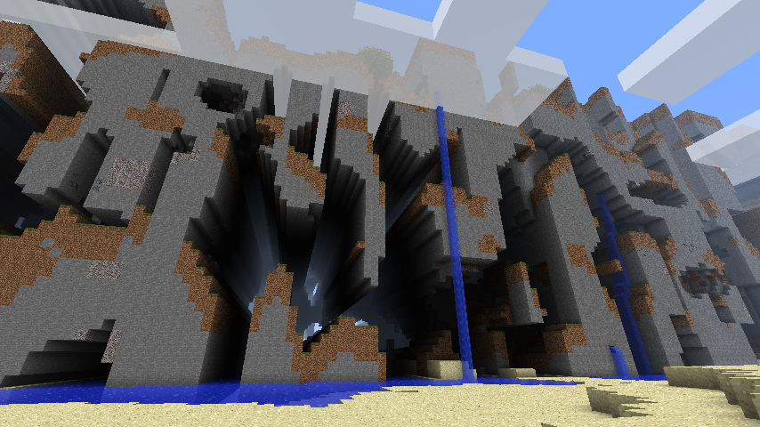

# Dealing with infinity

In computing terms, nothing is truly infinite. But Sylves supports grids that have all the computing tricks needed giving the appearance of infinity:

* the grids are very, very large
* details can be filled in on the fly
* very little needs to be stored by the system
* floating point precision is managed to avoid glitches

These same tricks power almost all "infinite" worlds, such as Minecraft, No Man's Sky, etc. In this tutorial, we'll cover how these tricks work, and how to use them in your own game building on Sylves.

Most grids in Sylves are infinite by default. You have to [bound](bounds.md) the grid in order to get something finite. Infinite grids can be detected by checking the [`IsFinite`](xref:Sylves.IGrid.IsFinite) property, and they will typically throw [GridInfiniteException](xref:Sylves.GridInfiniteException) if you try to do any eager operation that needs the full set of tiles, such as GetCells.

### Grids are very, very large.

The Cell struct Sylves uses are an x, y, z co-ordinate, each an `int`. That means that the maximum extent of a grid is from -2,147,483,648 to 2,147,483,647 in each co-ordinate. The exact number of cells depends on the grid co-ordinate system - square grids have about 16 quintillion cells in them. That's usually enough for any practical purpose (but see [BigInteger support](#biginteger-support) if it isn't).

Supporting a similar range in your game is as simple as re-using `Sylves.Cell` in your own code, or at least storing co-ordinates as a 32-bit integer.

### The details can be filled in on the fly

`Cell` structs contain no data except the co-ordinate. All methods on a grid, such as [GetCellCenter](xref:Sylves.IGrid.GetCellCenter(Sylves.Cell)), take the co-ordinate and compute what is needed there and then. That means there is not a huge startup cost to pay when you create a grid - you only pay for what you use, which is a tiny fraction of the grid.

<video tabindex="-1" aria-label="video player" style="object-fit: contain; width:500px; max-width:100%;" src="../../images/horizon_frustrum_culling.mp4" autoplay loop muted></video>

You can do the same for aspects of your game. Rather than create everything all at once, you procedurally generate it on demand. This is often called lazy generation. There's several popular techniques for this. Some important ones to know include:
* "fields" like perlin noise that can mathematically make a coherent infinite image which can be lazily generated one pixel at a time
* "chunking" to subdivide your world into separately generated sections
* saving random seeds so that randomized processes can give consistent results every time they are run

I'd recommend starting by reading about Perlin noise, and then read [Alan Zucconi's article on Minecraft](https://www.alanzucconi.com/2022/06/05/minecraft-world-generation/) when you want to get into the technical weeds.

### Very little needs to be stored by the system

Computing on the fly doesn't just save on the amount of time needed to start up - it also saves on the amount of memory or storage your game needs. The majority of Sylves grids store a fixed amount of metadata that never grows, so they are very efficient on this front. There are a few grids that do need to save expensive calculations. These all use the same [caching](caching.md) system that gives you control over how long the memory is kept for.

In your game, you may find that you have rather more storage needs. The typical approach for infinite grids is to to have an on-the-fly calculation of the initial value of the grid, and then fill a store with just the changed cells. This allows a very large game world, providing you don't let users make an unreasonable amount of changes to it. The [Langton's Ant tutorial](../tutorials/langton.md) has a good example of this technique, as it stores a list of player-visited cells.

### Floating point precision is managed

Sylves uses `int` for co-ordinates, but `float` for many spatial operations. Floating point is a complex topic, but the main thing to be aware of is that it becomes less precise the larger a number is stored. In fact, by the time you get to ±16.7 million, it doesn't even have the accuracy to distinguish between two adjacent cells of size 1. This is far smaller than Sylves' supported grid size, so you'll run into problems unless you are careful.

This issue is responsible for the infamous [Far Lands bug](https://minecraft.fandom.com/wiki/Far_Lands) of Minecraft.

<a href="https://minecraft.wiki/w/Far_Lands"></a>

Managing this mostly means being careful about when to use floating point. Integer co-ordinates should be used wherever possible. Using `double` precision floats can also help, but Sylves has no support for this internally.

To completely resolve the problem, it is necessary to apply [Grid Recentering](#grid-recentering)

## Grid Recentering

Floating point precision is a common problem in games with large scales. It comes up in many space games which simulate human sized physics on a planet sized scale or larger.

If the problem is that floating point operations are only really acceptably accurate near the (0, 0, 0), the you need to ensure that all floating points in your game never really get too large, even as you explore farther out in the world.

The solution is a "floating origin", as seen, e.g. in [Kerbal Space Program](https://frozenfractal.com/blog/2024/4/11/around-the-world-14-floating-the-origin/). This designates an arbitrary point in space to be the origin. All floating point positions are computed *relative to the origin*. If the player moves too far away, you just move the origin to be closer. Everything in the vicinity of the origin is high precision, while stuff further away is worse quality. By keeping the origin near the player or camera, we can ensure users always see things happening with sufficient precision.

What does this look like in Sylves? Sylves has a special method [`Recenter(Cell cell)`](xref:Sylves.IGrid.Recenter(Sylves.Cell)) which returns a translated grid so that the given cell's center is at (0, 0, 0). This translation means that effectively all floating point operations done by the grid are relative to this origin cell. Internally, the translation is done with integer arithmetic, so it never has any precision issues.

You can use this recentering to set the origin to something nearby the player.

```csharp
IGrid grid = new SquareGrid(1);
Cell origin = new Cell(0, 0, 0);
Vector3 cameraPos = new Vector3(0, 0, 0); // Camera position, relative to origin

// Call this however you like to move the camera around
void PanCamera(Vector3 offset)
{
    cameraPos += offset;
    if(cameraPos.magnitude > 100)
    {
        grid.FindCell(cameraPos, out var newOrigin);
        RecenterGrid(newOrigin);
    }
}

void Recenter(Cell newOrigin)
{
    var offset = grid.GetCellCenter(newOrigin);
    grid = grid.Recenter(newOrigin);
    // Update all positions in the entire game to be relative to the new origin.
    // In this example the only position is camera, but you'd have to loop over all objects
    cameraPos -= offset;
}

void DrawWorld()
{
    const float CameraWidth = 80;
    const float CameraHeight = 40;
    var cameraMin = new Vector3(cameraPos.x - CameraWidth/2, cameraPos.y - CameraHeight/2, 0);
    var cameraMax = new Vector3(cameraPos.x + CameraWidth/2, cameraPos.y + CameraHeight/2, 0);
    // Loop over all cells visible to the camera
    foreach(var cell in grid.GetCellsIntersectsApprox(cameraMin, cameraM))
    {
        // Both grid.GetCellCenter and cameraPos are relative to the origin.
        // But graphics routines typically want things relative to the camera
        var positionRelativeToCamera = grid.GetCellCenter(cell) - cameraPos;
        DrawCell(cell, positionRelativeToCamera);
    }

}
```


Note: recentering only really helps precision in the vicinity of the origin. You should still aim to use integer co-ordinates for anything that needs high precision across the entire grid.


## BigInteger support

Sometimes, a quadrillion cells is not enough. If, for some perverse reason, you really need larger grids, then Sylves comes with a special build that replaces all `int` co-ordinates with [`System.Numerics.BigInteger`](https://learn.microsoft.com/en-us/dotnet/api/system.numerics.biginteger), which is C#'s built in class for representing arbitrarily large numbers. Each number is stored as an array of bytes, which itself can be long enough to be unlimited for all practical and impractical purposes.

You can find this custom build in the GitHub releases, or you can build it yourself by running the [`Sylves.BigIntRewriter`](https://github.com/BorisTheBrave/sylves/blob/main/src/Sylves.BigIntRewriter/Sylves.BigIntRewriter.csproj) project, which generates the source from scratch.

The majority of Sylves is completely unchanged in this build, but there are some minor differences to cell co-ordinates in some grids, and a few features are not supported. You will almost certainly need to apply the [Grid Recentering](#grid-recentering) technique described above too.

Example:

```csharp
using System.Numerics;
using Sylves;

var grid = new SquareGrid(1);
var oneTrillion = BigInteger.Pow(10, 12);
var cell = new Cell(OneTrillion, 2 * OneTrillion, 0);
foreach(var n in grid.GetNeighbours(cell))
{
    Console.WriteLine(n);
}
// Outputs
// (1000000000001, 2000000000000, 0)
// (1000000000000, 2000000000001, 0)
// (999999999999, 2000000000000, 0)
// (1000000000000, 1999999999999, 0)
Console.WriteLine(grid.GetCellCenter(cell));
// (1E+12, 2E+12, 0)
```