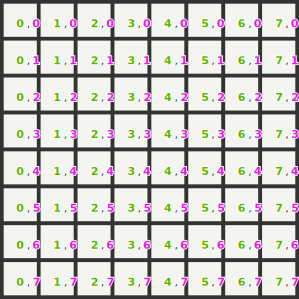
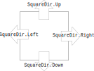

# Key Concepts

## Grids and cells

The central interface of Sylves is [IGrid](xref:Sylves.IGrid). Each grid type supported by Sylves has a different implementation of this class, such as [`CubeGrid`](xref:Sylves.CubeGrid) or [`HexGrid`](xref:Sylves.HexGrid).

Each grid is considered a collection of cells. Each cell is individual locations in a grid. In a square grid, each square is one cell. In a hexagon grid, each cell is one hexagon, etc.

<figure>

</figure>

Cells are represented by the [`Cell`](xref:Sylves.Cell) struct. A `Cell` object is just (x,y,z) co-ordinate, it contains no other data. If you want to know something specific about a cell, you must call a method on `IGrid` to look it up.

For example, `IGrid.GetCells()` returns an `IEnumerable<Cell>` listing all cells in the grid. And `IGrid.GetCellCenter(Cell cell)` returns the position of a given cell.  You could use them as follows:

```csharp
// Create a 10x10 grid of squares of size 1.
var grid = new SquareGrid(1, new SquareBound(0, 0, 10, 10));
// List all 100 cells
var cells = grid.GetCells();
// Print the centers of each cell.
foreach(var cell in cells)
{
    Console.Log($"{cell}: {grid.GetCellCenter(cell)}");
}
```

A summary of all methods is [below](#grid-methods) and the full list in the [API reference](xref:Sylves.IGrid).

Sylves supports an [extremely wide set of grids](../all_grids.md):
* Planar grids (those confined to the XY plane), the most common grids seen in games.
* 2d non-planar grids use 2d cells, but arranged in 3d space, can be used for 3d games where height is important, or for spheres and other shapes.
* 3d grids (aka [honeycombs](https://en.wikipedia.org/wiki/Honeycomb_(geometry))) are useful for voxel style calculations.
* Infinite grids allow you to not worry about the boundaries at all.
* Irregular grids can have a different shape for every cell.
* You can even [create your own grids](../creating.md).

NB: grids [do not store any data](storage.md), they are basically stateless. They just exist to as a way to interact with cells.

## What is a cell?

It's helpful to think of cells as a polygon. This is not true for 3d grids like `CubeGrid`, and 2d grids aren't required to actually have a polygonal shape, but this is the most common and simplest case.

Just like `IGrid` exists to describe a *collection* of cells, another interface, [`ICellType`](xref:Sylves.ICellType) describes the properties of a single cell. Again, this does not involve storing data, it just covers the geometric properties of the cell. Cell types are generally singletons like `SquareCellType.Instance` shared between all square cells.

The main thing `ICellType` is used for is working with cell directions, via the `CellDir` class. Cell directions are labels assigned to each edge of the cell (or to each face of a cell, for 3d cells). 

<figure>

</figure>

Cell directions are a key component of exploring the [topology](topology.md) of the grid.

Most of the other methods of `ICellType` deal with [rotations](rotation.md).

## Grid methods

The methods of `IGrid` can be rougly split into several categories. The most important being:

* Basics - Factual info about the grid, such as if is 2d, infinite, etc
* [Topology](topology.md) - Information about moving about the grid. This generally treats the grid as a network of cells, with links between adjacent cells.
* [Position](space.md) - Describes how the cells are laid out in 3d space, and their shape.

Other categories include:

* Relatives - Provides other grids related to the current grid.
* Index - Converts between `Cell` and `int`, if you want to use an array for storage
* [Bounds](bounds.md) - Methods of dealing with bounding boxes on the grid.
* Query - Methods for finding cells in 3d space, such as point queries, raycasts, etc.

## Abstract and specific types

IGrid itself is an interface. When working with a specific grid, you must construct an implementation of that interface. But the methods of the interface are necessarily abstract and cannot discuss your specific grid.

That means it some cases, you will need to *manually* cast to specific types, to get the most out of Sylves.

1) When working with interfaces, such as `IGrid`, `ICellType`, `IBounds`, you need to know which implementation is relevant to you. The implementations often have *more* methods than the interface does. E.g. when using a `SquareGrid`, you'd also work with `SquareCellType` and `SquareBound`.

2) When working with enums, like `CellDir` and `CellRotation`, you'll find that they are empty. These types are just a shorthand that *some* value is stored within. To be more specific, you'll need to cast them to specific types, like `SquareDir` and `SquareRotation`. The specific enums often come with methods and operator overloads.

This table gives a summary of some of the specific classes backing each grid. The docs for each grid class list the same details.

|IGrid|ICellType|CellDir|CellRotation|IBound|
|-----|---------|-------|------------|------|
|`SquareGrid`|`SquareCellType`|`SquareDir`|`SquareRotation`|`SquareBound`|
|`HexGrid`|`HexCellType`|`PTHexDir` *or* `FTHexDir`|`HexRotation`|`HexBound`|
|`TriangleGrid`|`HexCellType`|`PTHexDir` *or* `FTHexDir`|`HexRotation`|`HexBound`|
|`HexPrismGrid`|`HexPrismCellType`|`HexPrismDir`|`HexRotation`|`HexPrismBound`|
|`MeshGrid`|* |* |* | `null`|
|`MeshPrismGrid`|* |* |* | `null`|

\* = Varies

It's also worth noting that `SquareCellType` and `HexCellType` can be used interchangably with `NGonCellType`, allowing you to treat all polygon cells similarly.