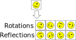
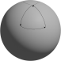
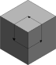
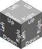

# Rotation

For many games and other usages of grids, you never need to worry about rotating things. In chess, for example, the units move in fixed patterns. Or for a height map, you just need a single number per cell.

But in other usages, the facing direction of objects matters, or you wish to re-use the same tile image in a different orientation. For these, sooner or later, you'll need to worry about rotations.

Rotations are complicated to understand fully, and you are recommended to avoid them until you are comfortable with cells, cell types and grids, as described in the [intro](intro.md).

## What is a rotation?

In Sylves, a `CellRotation` describes any rotation of a single cell that maps the cell onto itself.

For example, for a square cell, there are 4 rotations, corresponding to rotating by 0, 90, 180 or 270 degrees.
Rotating by, say, 45 degrees is not a rotation, as that would transform a square to a diamond, not back to the original square.

There's also 4 reflections that map a square onto itself. Reflections are treated the same as rotations in Sylves, and usually we'll use rotation to refer to both of them.



Transformations that map something back onto itself are known as symmetries in mathematics.

`CellRotation` is actually an empty enumeration - the actual values are specific to the cell type in question. So to work with rotations, you must either cast to a more specific type, like `SquareRotation`, or you must use the appropriate `ICellType` implementation, `SquareCellType.Instance`.

Rotations only consider a single cell at a time. For rotating an entire grid, see [Grid Symmetry](grid_symmetry.md) or [TransformModifier](xref:Sylves.TransformModifier).

### 2d/3d rotations

2d rotations are the easiest to consider. If a polygon has $n$ sides, then there are $n$ rotations, each a multiple of $360 / n$ degrees, which are stored as positive integers in counterclockwise order.
There's also $n$ possible reflections, which are stored as negative numbers.

So a 2d rotation will have `-n <= (int)rotation < n`.

`SquareCellType`, `HexCellType` and `NGonCellType` [all work this way](https://en.wikipedia.org/wiki/Dihedral_group).

Sylves also supports `CubeCellType`, which uses `CubeRotation` that supports all 48 rotations / reflections of a cube.

## Basic usage

Most of the key methods of rotations are on ICellType, as rotations only consider a single cell.

* [`GetIdentity`](xref:Sylves.ICellType.GetIdentity) - gets the rotation that does nothing.
* [`GetRotations`](xref:Sylves.ICellType.GetRotations(System.Boolean)) - gets all rotations (and optionally reflections) of a cell
* [`Invert`](xref:Sylves.ICellType.Invert(Sylves.CellRotation)) - finds the rotation that undoes the given rotation
* [`RotateCCW`](xref:Sylves.ICellType.RotateCCW)/[`RotateCW`](xref:Sylves.ICellType.RotateCW) - rotate left/right (2d cell types only)

The main thing you can do with a rotation, is rotate things by it.

* [`Rotate`](xref:Sylves.ICellType.Rotate(Sylves.CellDir,Sylves.CellRotation)) - rotate a `CellDir` by a given `CellRotation`
* [`Multiply`](xref:Sylves.ICellType.Multiply(Sylves.CellRotation,Sylves.CellRotation)) - compose two rotations together into a single one
* [`GetMatrix`](xref:Sylves.ICellType.GetMatrix(Sylves.CellRotation)) - get a rotation as a matrix, so you can transform vectors.

If you use specific classes like `SquareRotation`, they usually have the `*` operator overloaded as a shorthand for applying rotations, and many other convenience methods.

## TryMove and Rotation

A classic riddle goes: *"A bear travels one mile south, one mile east, then one mile north and finds itself back at home. What color is the bear?"*.

The answer of course, is white - the only place on earth where this is possible is near the north pole. But it does illustrate an important about motion - when you travel on curved or distored surfaces, things work differently. Our bear took two 90 degree turns, but somehow ended up returning home at an angle.



The same issue comes up in some of the more complicated grids of Sylves. Let's consider a grid that uses the faces of a cube - it has 6 faces, each a square. The exact same problem shows up:



If you follow this path, you end up rotated 90 degrees from where you started! This is the link between motion on a grid, and rotation.

---

In order to deal with this sort of situation, when you call [`IGrid.TryMove`](xref:Sylves.IGrid.TryMove(Sylves.Cell,Sylves.CellDir,Sylves.Cell@,Sylves.CellDir@,Sylves.Connection@)), in addition to returning the tile you move to, you get `inverseDir` and `connection`, which explain what is happening.

Let's ignore connection for now, as it is irrelevant to the majority of grids. `inverseDir` returns the `CellDir` needed to move *back* to the original cell. Why is `inverseDir` so important?

Well, for the basic grids, like SquareGrid, HexGrid, CubeGrid, `inverseDir` is always the obvious choice. If you move left, then inverseDir will be right. Same for up/down, etc.

On our 3d cube example however, it's simply not possible for the directions to all the consistent like that. Here's one way we *could* label the cube.

.

When we `TryMove` from the top face, in direction `SquareDir.Down`, we end up on the left face. And inverseDir will be `SquareDir.Up`.

Then, we can `TryMove` from the left face to the right one, via `SquareDir.Right`. The inverseDir would be `SquareDir.Left`.

But moving from the right face to the top one, via `SquareDir.Up`, we'd find that the inverseDir would be `SquareDir.Right`! That is telling us that the frame of reference has rotated as we moved. And we could even measure that rotation:

```csharp
var actualDirection = (CellDir)SquareDir.Right;
var expectedDirection = SquareCellType.Instance.Invert((CellDir)SquareDir.Up).Value;
SquareCellType.Instance.TryGetRotation(actualDirection, expectedDirection, new Connection(), out var rotation);
// Now rotation == SquareRotation.RotateCW
```

This general concept is called rotation maps and is covered in [more details on my blog](https://www.boristhebrave.com/2022/07/31/rotation-graphs/).