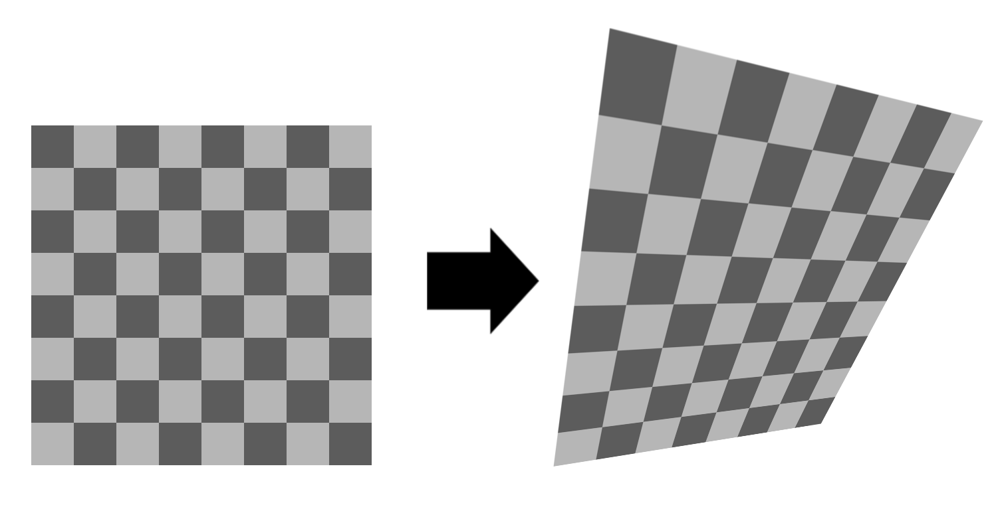

# Shape

Shape methods return details about the border of each cell.

Cells are typically polygons, for 2d, or meshes, for 3d.

### [`GetPolygon`](xref:Sylves.IGrid.GetPolygon(Sylves.Cell,Sylves.Vector3[]@,Sylves.Matrix4x4@))

*(2d only)* gives the vertices making up the polygon of the cell. There's also an [extension method](xref:Sylves.GridExtensions.GetMeshData(Sylves.IGrid,Sylves.Cell)) that's easier to use.

### [`GetMeshData`](xref:Sylves.IGrid.GetMeshData(Sylves.Cell,Sylves.MeshData@,Sylves.Matrix4x4@)) 

*(3d only)* Gets the mesh of a single cell.

### [`ToMeshData`](xref:Sylves.GridExtensions.ToMeshData(Sylves.IGrid))

Converts the whole grid to a mesh.

### [`GetAabb`](xref:Sylves.IGrid.GetAabb(Sylves.Cell))

Gets the bounding box for a cell of collection of cells. See also [`GetBoundAabb`](xref:Sylves.IGrid.GetBoundAabb(Sylves.IBound))

## Deformation

For advanced grids, particularly [MeshGrid](../grids/meshgrid.md), each cell of the grid may be a different shape, even though they share the same cell type.

In this case, you can call [`GetDeformation`](xref:Sylves.IGrid.GetDeformation(Sylves.Cell)) which returns a [`Deformation`](xref:Sylves.Deformation). This class assists in smoothly interpolating across that irregular shape.

Each deformation is a continuous map, which maps a cell from its canonical shape (a regular square, triangle, etc) to the shape of a specific cell in the grid. This is done via linear/bilinear or trilinear interpolation as appropriate.