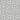
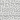
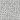

<table>
<tr>
    <td><a href="../../images/grids/domino.svg"></img></td>
    <td><a href="xref:Sylves.DominoGrid">Domino Grid</a> A grid of dominos (6 sided cells the shape of a rectangle) tiled in an aperiodic pattern.</td>
</tr>
<tr>
    <td><a href="../../images/grids/penrose_rhomb.svg"></img></td>
    <td><a href="xref:Sylves.PenroseRhombGrid">Penrose Rhomb Grid</a> Also known as the <a href="https://en.wikipedia.org/wiki/Penrose_tiling#Rhombus_tiling_(P3)">penrose P3 tiling.</a></td>
</tr>
<tr>
    <td><a href="../../images/grids/chair.svg"></img></td>
    <td><a href="xref:Sylves.ChairGrid">Chair Grid</a> The <a href="https://en.wikipedia.org/wiki/Chair_tiling">Chair Tiling</a> is a simple L shaped aperiodic <a href="https://en.wikipedia.org/wiki/Rep-tile">rep-tile</a>.</td>
</tr>
<tr>
    <td><a href="../../images/grids/ammann_beenker.svg"></img></td>
    <td><a href="xref:Sylves.AmmannBeenkerGrid">Ammann-Beenker Grid</a> <a href="https://en.wikipedia.org/wiki/Ammann%E2%80%93Beenker_tiling">The Ammann-Beenker tiling</a>.</td>
</tr>
<tr>
    <td><a href="../../images/grids/sphinx.svg"></img></td>
    <td><a href="xref:Sylves.SphinxGrid">Sphinx Grid</a> The <a href="https://en.wikipedia.org/wiki/Sphinx_tiling">Sphinx tiling</a> is another classic <a href="https://en.wikipedia.org/wiki/Rep-tile">rep-tile</a>.</td>
</tr><tr>
    <td><a href="../../images/grids/pinwheel.svg"></img></td>
    <td><a href="xref:Sylves.PinwheelGrid">Pinwheel Grid</a> The <a href="https://en.wikipedia.org/wiki/Pinwheel_tiling">Pinwheel tiling</a> has the property that the tiles appear in infinitely many orientations.</a>.</td>
</tr>
</table>