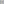

# HexGrid

<table>
<tr><th colspan="2">Quick facts</th></tr>
<tr><td>Grid</td><td><a href="xref:Sylves.HexGrid">HexGrid</a></td></tr>
<tr><td>CellType</td><td><a href="xref:Sylves.HexCellType">HexCellType</a></td></tr>
<tr><td>CellDir</td><td><a href="xref:Sylves.PTHexDir">PTHexDir</a> / <a href="xref:Sylves.PTHexDir">FTHexDir</a></td></tr>
<tr><td>CellRotation</td><td><a href="xref:Sylves.HexRotation">HexRotation</a></td></tr>
<tr><td>Bound</td><td><a href="xref:Sylves.HexBound">HexBound</a></td></tr>
<tr><td>Properties</td><td>2d, Planar, Repeating, Infinite</td></tr>
</table>

HexGrid is a tiling of the plane with hexagons. It supports both flat-topped and pointy topped varieties.

</img>
</img>

The co-ordinate systems used are shown above - it uses three co-ordinates that always sum to zero. This scheme is explained in [more detail by Red Blob Games](https://www.redblobgames.com/grids/hexagons/).

Cell (0, 0, 0) has it's center at `new Vector3(0, 0, 0)`.

## Subdivision into triangles

HexGrid comes with extra methods to help subdivide each hex into six of the triangles found on a corresponding [triangle grid](trianglegrid.md).

  - [GetChildTriangleGrid](xref:Sylves.HexGrid.GetChildTriangleGrid) - Returns the triangle grid that subdivides this grid.
  - [GetChildTriangles](xref:Sylves.HexGrid.GetChildTriangles(Sylves.Cell)) - returns the cells for the 6 triangles in the child triangle grid that fill up this hex cell.
  - [GetTriangleParent](xref:Sylves.HexGrid.GetTriangleParent(Sylves.Cell)) - returns the hex cell that contains the triangle cell passed in.