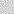

# Grid Bestiary

This page provides a full list of grid classes available in Sylves. You can always [create or customize your own grid](../creating.md) if the ones here don't quite match your purpose.

## Basic Grids

These are the most common grids you are likely to want to use.

<table>
<tr>
    <td><a href="../../images/grids/square.svg"></img></td>
    <td><a href="squaregrid.md">Square Grid</a></td>
</tr>
<tr>
    <td><a href="../../images/grids/cube.png"></img></td>
    <td><a href="cubegrid.md">Cube Grid</a></td>
</tr>
<tr>
    <td><a href="../../images/grids/hex_pt.svg"></img></td>
    <td><a href="hexgrid.md">Hex Grid</a> Supports both pointy topped and flat topped variants.</td>
</tr>
<tr>
    <td><a href="../../images/grids/tri_fs.svg"></img></td>
    <td><a href="trianglegrid.md">Triangle Grid</a> Supports vertical and horizontal variants.</td>
</tr>
</table>

## Periodic Grids

Periodic grids have a pattern that repeats via translation. These are usually called [tessellations](https://en.wikipedia.org/wiki/Tessellation). 

All the basic grids above are periodic, but some extra ones are supplied.

<table>
<tr>
    <td><a href="../../images/grids/cairo.svg"></img></td>
    <td><a href="periodicplanarmeshgrid.md">Cairo Grid</a></td>
</tr>
<tr>
    <td><a href="../../images/grids/trihex.svg"></img></td>
    <td><a href="periodicplanarmeshgrid.md">TriHex Grid</a></td>
</tr>
<tr>
    <td><a href="../../images/grids/metahexagon.svg"></img></td>
    <td><a href="periodicplanarmeshgrid.md">MetaHexagon Grid</a></td>
</tr>
<tr>
    <td><a href="../../images/grids/squaresnub.svg"></img></td>
    <td><a href="periodicplanarmeshgrid.md">SquareSnub Grid</a></td>
</tr>
<tr>
    <td><a href="../../images/grids/tetrakissquare.svg"></img></td>
    <td><a href="periodicplanarmeshgrid.md">TetrakisSquare Grid</a></td>
</tr>
<tr>
    <td><a href="../../images/grids/rhombille.svg"></img></td>
    <td><a href="periodicplanarmeshgrid.md">Rhombille Grid</a></td>
</tr>
</table>

You can create your own periodic grids with <xref:Sylves.PeriodicPlanarMeshGrid>, described below.

## Mesh Grids

Mesh grids accept a [mesh](xref:Sylves.MeshData) as the input, and base cells of the grid off faces of the mesh.

<table>
<tr>
    <td><a href="../../images/grids/meshgrid.svg"></img></td>
    <td><a href="meshgrid.md">Mesh Grid</a> Turns a mesh into a 2d grid, one cell per face. Doesn't need to be planar.</td>
</tr>
<tr>
    <td><a href="../../images/grids/meshprism.png"></img></td>
    <td><a href="meshprismgrid.md">MeshPrismGrid</a> Turns a mesh into a 3d grid, one cell being one extruded face in a given layer.</td>
</tr>
<tr>
    <td><a href="../../images/grids/cairo.svg"></img></td>
    <td><a href="periodicplanarmeshgrid.md">PeriodicPlanarMeshGrid</a> Can turn any planar mesh into a periodic grid by repeating the mesh at fixed intervals.</td>
</tr>
<tr>
    <td><a href="../../images/grids/townscaper.svg"></img></td>
    <td><a href="xref:Sylves.PlanarLazyMeshGrid">PlanarLazyMeshGrid</a> Like PeriodicPlanarMeshGrid, splits the plane into periodic chunks and draws a mesh in each chunk. But the meshes are lazily loaded from a user-specified function, so don't have to repeat.</td>
</tr>
</table>

## Prism Grids

"Prisms" are when you take a 2d polygon, and extrude it into a 3d shape. 
This can convert 2d grids into 3d ones, usually with the z-cordinate being the "layer", i.e. offset from the original grid.

<table>
<tr>
    <td><a href="../../images/grids/meshprism.png"></img></td>
    <td><a href="meshprismgrid.md">MeshPrismGrid</a> Turns a mesh into a 3d grid, one cell being one extruded face in a given layer.</td>
</tr>
<tr>
    <td><a href="../../images/grids/hexprism.png"></img></td>
    <td><a href="xref:Sylves.HexPrismGrid">HexPrismGrid</a> A special case of PlanarPrismModifier applied to a hex grid. </td>
</tr>
<tr>
    <td><a href="../../images/grids/triangleprism.png"></img></td>
    <td><a href="xref:Sylves.TrianglePrismGrid">TrianglePrismGrid</a> A special case of PlanarPrismModifier applied to a triangle grid. </td>
</tr>
<tr>
    <td><a href="../../images/grids/planarprismmodifier.png"></img></td>
    <td><a href="xref:Sylves.PlanarPrismModifier">PlanarPrismModifier</a> Takes a 2d planar grid, and extends it into multiple layers along the third the dimension. </td>
</tr>
</table>

## Substitution Tiling Grids

[Substitution tiling grids](substitutiontilinggrid.md) use recursive subdivision to fill the space with tiles. They are well known as a way of creating [aperiodic tilings](https://en.wikipedia.org/wiki/Aperiodic_tiling).

[!include]

## Voronoi Grids

<table>
<tr>
    <td><a href="../../images/grids/voronoi.svg"></img></td>
    <td><a href="voronoigrid.md">VoronoiGrid</a> Creates a grid from a <a href="https://en.wikipedia.org/wiki/Voronoi_diagram">Voronoi diagram</a> based on a set of input points.</td>
</tr>
<tr>
    <td><a href="../../images/grids/jitteredsquare.svg"></img></td>
    <td><a href="jitteredsquaregrid.md">JitteredSquareGrid</a> An infinite version of <a href="voronoigrid.md">VoronoiGrid</a> where the points are taken from random positions in the cells of a square grid.</td>
</tr>
<tr>
    <td><a href="../../images/grids/voronoi_sphere.png"></img></td>
    <td><a href="xref:Sylves.VoronoiSphereGrid">VoronoiSphereGrid</a> An spherical version of a voronoi grid, where points are on the surface of the unit sphere.</td>
</tr>
</table>

## Radial
Radial grids have rotational symmetry.
<table>
<tr>
    <td><a href="../../images/grids/radial_rhombic.svg"></img></td>
    <td><a href="xref:Sylves.RadialGrids.Rhombic">RadialGrids.Rhombic</a> Creates a radial grid of rhombuses and squares inspired by <a href="https://robertlovespi.net/2021/05/28/a-radial-tessellation-of-the-plane-using-squares-and-45-135-degree-rhombi/">Robert Austin's design.</a></td>
</tr>
<tr>
    <td><a href="../../images/grids/radial_octagonal.svg"></img></td>
    <td><a href="xref:Sylves.RadialGrids.Octagonal">RadialGrids.Octagonal</a> Creates a radial grid of irregular octagons inspired by <a href="hhttps://robertlovespi.net/2016/01/02/octagons-can-tile-a-plane-iii/">Robert Austin's design.</a></td>
</tr>
</table>

## Modifier Grids

Modifier grids let you customize an existing grid by systematically changing it in some way.

[!include]
## Extra Grids

These grids don't classify neatly and usually serve as demos for various features.

<table>
<tr>
    <td><a href="../../images/grids/mobiussquare.png"></img></td>
    <td><a href="xref:Sylves.MobiusSquareGrid">MobiusSquareGrid</a> A grid in the shape of a <a href="https://en.wikipedia.org/wiki/M%C3%B6bius_strip">Möbius strip</a>. This is mostly to demonstrate how Sylves handles <a href="https://en.wikipedia.org/wiki/Orientability">non-orientable surfaces</a>. </td>
</tr>
<tr>
    <td><a href="../../images/grids/cubius.png"></img></td>
    <td><a href="xref:Sylves.CubiusGrid">CubiusGrid</a> A <a href="https://en.wikipedia.org/wiki/M%C3%B6bius_strip">Möbius strip</a> with thickness, and only a quarter turn instead of a half turn. This is mostly to demonstrate how Sylves handles advanced cases of <a href="https://en.wikipedia.org/wiki/Holonomy">holonomy</a>. </td>
</tr>
<tr>
    <td><a href="../../images/grids/wrap_square_fake.svg"></img></td>
    <td><a href="xref:Sylves.WrappingSquareGrid">WrappingSquareGrid</a> A bounded square grid the wraps at the edges back onto itself.</td>
</tr>

<tr>
    <td><a href="../../images/grids/wrap_hex_fake.svg"></img></td>
    <td><a href="xref:Sylves.WrappingHexGrid">WrappingHexGrid</a> A bounded hexagon grid that wraps on the edges back to itself.</td>
</tr>
<tr>
    <td><a href="../../images/grids/townscaper.svg"></img></td>
    <td><a href="xref:Sylves.TownscaperGrid">TownscaperGrid</a> This is a specific implementation of <a href="planarlazymeshgrid.md">PlanarLazyMeshGrid</a> with a <a href="../modifiers/relaxmodifier.md">RelaxModifier</a> applied. It is modelled after the grid used for <a href="https://store.steampowered.com/app/1291340/Townscaper/">Townscaper</a></td>
</tr>
<tr>
    <td><a href="../../images/grids/off.svg"></img></td>
    <td><a href="offgrid.md">OffGrid</a> This implements <a href="https://gitlab.com/chriscox/offgrid/-/wikis/home">Chris Cox's OffGrid</a>, a packed grid of irregular rectangles.</td>
</tr>
</table>