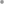
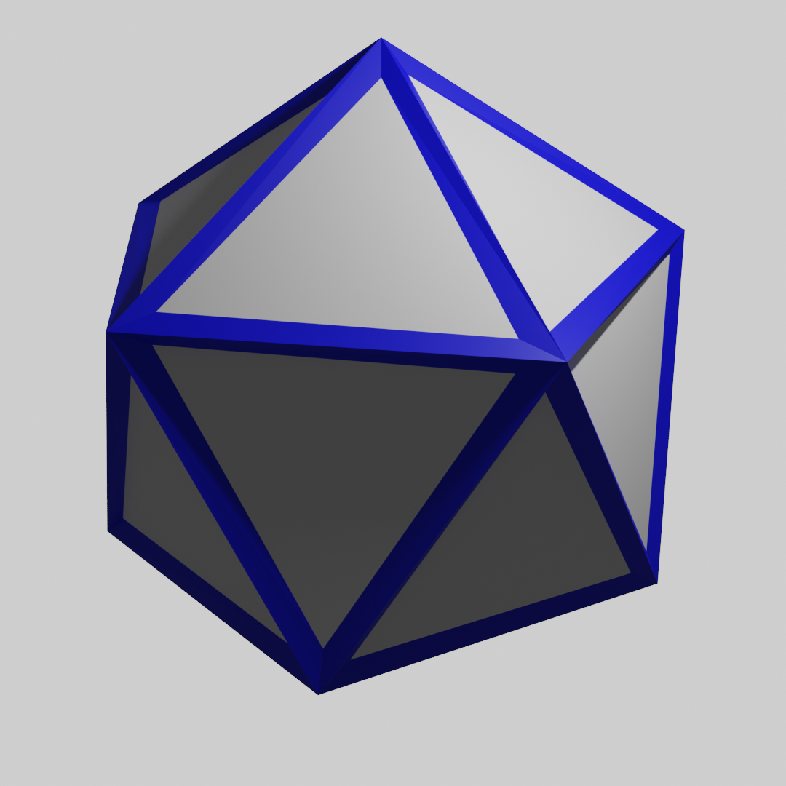

# MeshGrid

<table>
<tr><th colspan="2">Quick facts</th></tr>
<tr><td>Grid</td><td><a href="xref:Sylves.MeshGrid">MeshGrid</a></td></tr>
<tr><td>CellType</td><td><a href="xref:Sylves.NGonCellType">NGonCellType</a>*</td></tr>
<tr><td>CellDir</td><td><a href="xref:Sylves.CellDir">CellDir</a>*</td></tr>
<tr><td>CellRotation</td><td><a href="xref:Sylves.CellRotation">CellRotation</a>*</td></tr>
<tr><td>Bound</td><td>None</td></tr>
<tr><td>Properties</td><td>2d, Finite</td></tr>
<tr><td colspan="2"><small>*NGonCellType represents any polygon. But for 4 and 6 sided faces, the values overlap with SquareCellType and HexCellType, and the corresponding SquareDir, SquareRotation, PTHexDir, HexRotation.</small></td></tr>
</table>

MeshGrid represents any finite grid constructed out of polygons. Each polygon (or "face") becomes a cell, with two cells being adjacent if they share an edge in common. 
MeshGrid is one of the most flexible grid offered by Sylves

</img>

MeshGrid is a 2d grid as each cell is flat, but they don't have to be confined to a flat plane. It can just as easily represent a surface curving through 3d space, such as a polyhedron.

</img>

MeshGrids are constructed from a [MeshData](xref:Sylves.MeshData) and a [MeshGridOptions](xref:Sylves.MeshGridOptions) object.

## MeshData

MeshData described a Mesh in a fashion nearly identical to [Unity's Mesh object](https://docs.unity3d.com/ScriptReference/Mesh.html): You supply an array of Vector3 that gives the vertices of the mesh, and then an array of "indices" that indicate which vertices belong to which faces. The exact format of the indices array is given by a values from [MeshTopology](xref:Sylves.MeshTopology):

* [MeshTopology.Triangles](xref:Sylves.MeshTopology.Triangles) - Each set of three consecutive elements in the index array specifies one triangle.
* [MeshTopology.Quads](xref:Sylves.MeshTopology.Quads) - Each set of four consecutive elements in the index array specifies one quad.
* [MeshTopology.NGon](xref:Sylves.MeshTopology.NGon) - Each "run" of elements in the index array specifies one polygon. A run is a series of non-negative integers followed by a negative integer. The negative integer will be bitwise negated (the `~` operator) to convert it to an index.

<!--
You can use [MeshUtils.GetFaces](xref:Sylves.MeshUtils.GetFaces) to work with idicies in a consistent fashion regardless of the MeshTopology type.
-->

Optionally, you can also supply, uvs, normals and tangents in a MeshData, for use cases that use those. You can also supply more than one index array and MeshTopology value, to breakdown the mesh into multiple submeshes, usally when each submesh uses a different material when rendering.

Internally, MeshGrid stores cells in a [spatial hash](https://en.wikipedia.org/wiki/Glossary_of_computer_graphics#Spatial_hashing) to efficiently find cells when queried. This may lead to performance issues if the cells are wildy different sizes to each other.

## MeshGridOptions

**UseXZPlane**

If set, assumes the 2d plane that a face maps from is in the XZ axis.

**InvertWinding**

If false, vertices and edges of the mesh are assumed to be consistent with Sylves conventions,
counter clockwise winding.

E.g. for a quad
 * edges 0 => SquareDir.Right, 1 => SquareDir.Up, 2 => SquareDir.Left, 3 => SquareDir.Down
 * verts 0 => DownRight, 1 => UpRight, 2 => UpLeft, 3=> DownLeft

If true, the order of vertices is swapped

E.g. for a quad
* edges 0 => Square.Left, 1 => SquareDir.Up, 2 => SquareDir.Right, 3 => SquareDir.Down
* verts 0 => DownLeft, 1 => UpLeft, 2=> UpRight, 3 = DownRight

**DoubleOddFaces**

If set, odd faces become cells with twice as many edges.
It's often more convenient to work with even polygons as an about face is possible.

## Cell co-ordinates

The x value is used to index the face in the submesh, the y value indicates the submesh, if any, and the z value is unused.

## Deformation

TODO