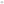
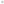
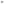
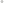
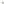
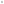

<table>
<tr><th colspan="2">Quick facts</th></tr>
<tr><td>Grid</td><td><a href="xref:Sylves.PeriodicPlanarMeshGrid">PeriodicPlanarMeshGrid</a></td></tr>
<tr><td>CellType</td><td><a href="xref:Sylves.NGonCellType">NGonCellType</a>*</td></tr>
<tr><td>CellDir</td><td><a href="xref:Sylves.CellDir">CellDir</a>*</td></tr>
<tr><td>CellRotation</td><td><a href="xref:Sylves.CellRotation">CellRotation</a>*</td></tr>
<tr><td>Bound</td><td><a href="xref:Sylves.SquareBound">SquareBound</a></td></tr>
<tr><td>Properties</td><td>2d, Planar, Repeating, Infinite</td></tr>
<tr><td colspan="2"><small>*NGonCellType represents any polygon. But for 4 and 6 sided faces, the values overlap with SquareCellType and HexCellType, and the corresponding SquareDir, SquareRotation, PTHexDir, HexRotation.</small></td></tr>
</table>

PeriodicPlanarMeshGrid is a variant of [MeshGrid](meshgrid.md) which takes that finite grid, and repeats it translated at fixed intervals to fill the infinite plane. It only supports planar meshes (those where all vertices have z=0).

To construct a PeriodicPlanarMeshGrid, you need to supply a planar mesh, and two stride vectors, which show how much to translate the mesh by to line it up with itself.

This grid comes with several built in subclasses to demonstrate some common tilings.

<table>
<tr>
    <th>Input mesh</th>
    <th>Result</th>
    <th>Class</th>
</tr>
<tr>
    <td><a href="../../images/seeds/cairo.svg"></img></td>
    <td><a href="../../images/grids/cairo.svg"></img></td>
    <td><a href="xref:Sylves.CairoGrid">Cairo Grid</a></td>
</tr>
<tr>
    <td><a href="../../images/seeds/trihex.svg"></img></td>
    <td><a href="../../images/grids/trihex.svg"></img></td>
    <td><a href="xref:Sylves.TriHexGrid">TriHex Grid</a></td>
</tr>
<tr>
    <td><a href="../../images/seeds/metahexagon.svg"></img></td>
    <td><a href="../../images/grids/metahexagon.svg"></img></td>
    <td><a href="xref:Sylves.MetaHexagonGrid">MetaHexagon Grid</a></td>
</tr>
<tr>
    <td><a href="../../images/seeds/squaresnub.svg"></img></td>
    <td><a href="../../images/grids/squaresnub.svg"></img></td>
    <td><a href="xref:Sylves.SquareSnubGrid">SquareSnub Grid</a></td>
</tr>
<tr>
    <td><a href="../../images/seeds/tetrakissquare.svg"></img></td>
    <td><a href="../../images/grids/tetrakissquare.svg"></img></td>
    <td><a href="xref:Sylves.TetrakisSquareGrid">TetrakisSquare Grid</a></td>
</tr>
<tr>
    <td><a href="../../images/seeds/rhombille.svg"></img></td>
    <td><a href="../../images/grids/rhombille.svg"></img></td>
    <td><a href="xref:Sylves.RhombilleGrid">Rhombille Grid</a></td>
</tr>
</table>

> [!Note]
> Unlike mathematical tilings, this grid doesn't support doing any rotations of the input mesh, it only slides. You may need the input mesh to have multiple copies of each tile at different rotations in order to handle this.

## Cell co-ordinates

The x value indicates the face in the mesh, and the y and z values indicate the multiple of stride moved in the two directions.