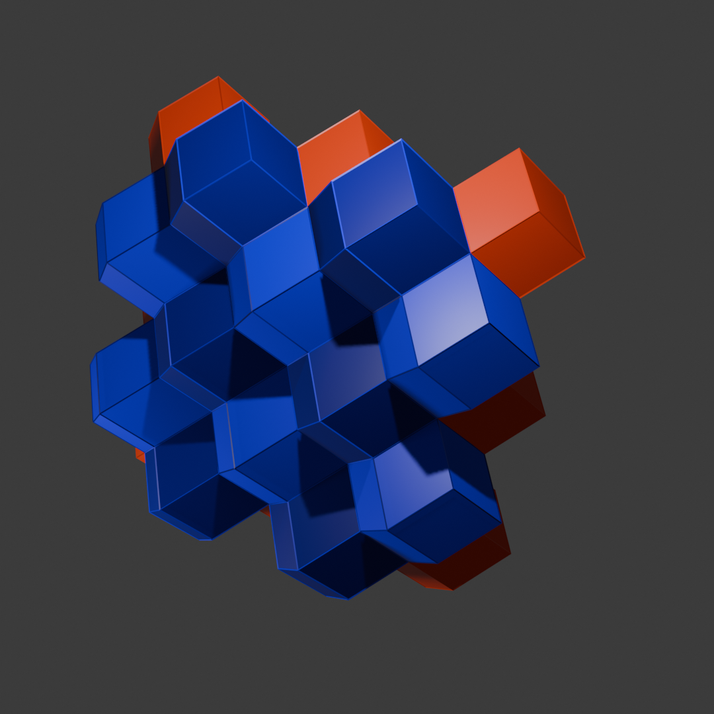

# RhombicDodecahedronGrid

<table>
<tr><th colspan="2">Quick facts</th></tr>
<tr><td>Grid</td><td><a href="xref:Sylves.RhombicDodecahedronGrid">RhombicDodecahedronGrid</a></td></tr>
<tr><td>CellType</td><td><a href="xref:Sylves.RhombicDodecahedronCellType">RhombicDodecahedronCellType</a></td></tr>
<tr><td>CellDir</td><td><a href="xref:Sylves.RhombicDodecahedronDir">RhombicDodecahedronDir</a></td></tr>
<tr><td>CellRotation</td><td><a href="xref:Sylves.RhombicDodecahedronRotation">RhombicDodecahedronRotation</a></td></tr>
<tr><td>Bound</td><td><a href="xref:Sylves.CubeBound">CubeBound</a></td></tr>
<tr><td>Properties</td><td>3d, Repeating, Infinite</td></tr>
</table>

RhombicDodecahedronGrid is a 3d [honeycomb](https://en.wikipedia.org/wiki/Honeycomb_(geometry)) of [rhombic dodecahedra](https://en.wikipedia.org/wiki/Rhombic_dodecahedron). It is the Voronoi tessellation of the [face-centered cubic](https://en.wikipedia.org/wiki/Cubic_crystal_system#Face-centered_cubic) lattice, so each cell has 12 neighbours.

</img>

`RhombicDodecahedronRotation` uses the same octahedral group as [`CubeRotation`](xref:Sylves.CubeRotation), so there are 48 possible values (of which 24 are various reflections).

## Cell co-ordinates

Cells use the same integer co-ordinates as [CubeGrid](cubegrid.md), but only cells where `x + y + z` is even are in the grid. The 12 neighbours of a cell are the even-parity cells at offset `(±1, ±1, 0)` and permutations, corresponding to the values of <xref:Sylves.RhombicDodecahedronDir>.

Cell centers match CubeGrid: the cell (0, 0, 0) is centered at `new Vector3(0.5f, 0.5f, 0.5f)` (for a grid with cell size of 1). Each cell covers its even cube plus pyramids into the six adjacent odd cubes, with vertices at those odd cubes' centers.

Bounds use [`CubeBound`](xref:Sylves.CubeBound), the same as CubeGrid. Odd-parity positions inside the bound are skipped.
