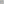

<table>
<tr>
    <td><a href="../../images/grids/transform_square.svg"></img></td>
    <td><a href="../modifiers/transformmodifier.md">TransformModifier</a> Changes the world space positioning of the grid by a linear transform, leaving everything else unchanged.</td>
</tr>
<tr>
    <td><a href="../../images/grids/mask_square.svg"></img></td>
    <td><a href="../modifiers/maskmodifier.md">MaskModifier</a> Filters the cells in the the grid to a customizable subset.</td>
</tr>
<tr>
    <td><a href="../../images/grids/biject_square.svg"></img></td>
    <td><a href="../modifiers/bijectmodifier.md">BijectModifier</a> Remaps the cells of the grid by changing their co-ordinates, without touching the position, shape or topology.</td>
</tr>
<tr>
    <td><a href="../../images/grids/ravel_square.svg"></img></td>
    <td><a href="../modifiers/ravelmodifier.md">RavelModifier</a> Relabels all the cell co-ordinates to be 1d, i.e. cell.y and cell.z are always zero.</td>
</tr>
<tr>
    <td><a href="../../images/grids/planarprismmodifier.png"></img></td>
    <td><a href="../modifiers/planarprismmodifier.md">PlanarPrismModifier</a> Takes a 2d planar grid, and extends it into multiple layers along the third the dimension.</td>
</tr>
<tr>
    <td><a href="../../images/grids/wrap_square_fake.svg"></img></td>
    <td><a href="../modifiers/wrapmodifier.md">WrapModifier</a> Turns any bounded grid into a grid which connects back on itself when you leave the grounds. </td>
</tr>
<tr>
    <td><a href="../../images/grids/relax_square.svg"></img></td>
    <td><a href="../modifiers/relaxmodifier.md">RelaxModifier</a> Applies mesh relaxation to any grid, smoothing out sharp edges.</td>
</tr>
<tr>
    <td><a href="../../images/grids/nested_square.svg"></img></td>
    <td><a href="../modifiers/nestedmodifier.md">NestedModifier</a> Replaces every cell with another grid.</td>
</tr>
</table>