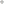

# MaskModifier

<table>
<tr><th colspan="2">Quick facts</th></tr>
<tr><td>Class</td><td><a href="xref:Sylves.MaskModifier">MaskModifier</a></td></tr>
<tr><td>CellType</td><td>Unchanged</td></tr>
<tr><td>CellDir</td><td>Unchanged</td></tr>
<tr><td>CellRotation</td><td>Unchanged</td></tr>
<tr><td>Bound</td><td>Unchanged</td></tr>
<tr><td>Properties</td><td>Unchanged or set to Finite</td></tr>
<tr><td>Requirements</td><td>None</td></tr>
</table>

This modifier restricts the set of cells in a grid. This operates much like [bounds](../concepts/bounds.md) do, but it supports an arbitrary set of cells, a bit less efficiently. That means that TryMove, FindCell etc will fail instead of returning cells that have not been included.

There are two modes of operations. Either you supply a finite set of cells, or you supply a function which returns true for cells that need to be included.

For example, here the modifier filters a grid to just cells lying on the x or y axes.

```csharp
centerSquare.Masked(cell => cell.x == 0 || cell.y == 0)
```

</img> ➡ </img>

This modifier can also be applied by extension methods [Masked](xref:Sylves.GridExtensions.Masked(Sylves.IGrid,System.Collections.Generic.ISet{Sylves.Cell})) or [Masked](xref:Sylves.GridExtensions.Masked(Sylves.IGrid,System.Func{Sylves.Cell,System.Boolean},System.Collections.Generic.IEnumerable{Sylves.Cell})).

## Cell co-ordinates

This modifier does not alter cell co-ordinates.