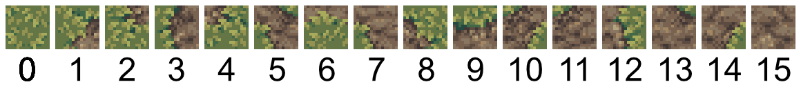

# Marching Squares

Marching squares, sometimes also called corner Wang tiling, is a clever technique for autotiling a grid with tiles.

This technique is often used to [describe making an isosurface](https://www.boristhebrave.com/2018/04/15/marching-cubes-tutorial/), but in this tutorial, we'll focus more on a bitwise trick for selecting tiles. [Here's good tutorial for the general idea](http://www.cr31.co.uk/stagecast/wang/2corn.html).

We're going to have a square grid. Then store a boolean value on each *vertex* of the grid. Then we will pick a tile for each cell of a grid, based on the 4 boolean values, found at the corners of the squares.

// TODO: images 

Because we want a single value per vertex, we need a key that uniquely identifies each vertex of the grid. This is where the [**dual grid**](../concepts/dual.md) comes in.

The dual grid is a grid with one cell per vertex in the base grid. Sylves comes with [many methods](../concepts/dual.md#working-with-dual-grids) for working with this grid.

## Setup

We define the grids we use. I'm using a square grid for simplicity. Square grids are so simple, you'll notice the Sylves code is a bit more verbose than just doing all the calculations yourself. But in fact this code and tutorial is generic and will work with any grid in Sylves.

```csharp
// Make the grid we're going to fill with tiles
IGrid baseGrid = new SquareGrid(1, new SquareBound(new Vector2Int(0, 0), new Vector2Int(20, 10)));
// Get the dual - we'll need this for working with corners
IDualMapping dualMapping = baseGrid.GetDual();
IGrid dualGrid = dualMapping.DualGrid;
// In this case, dual grid will itself be a square grid, but offset from base grid, and with size one larger (21 by 11)
```

`data` holds the actual values for each vertex. We'll decide what tile to use based on it.  As explained in the [concepts](../concepts/storage.md), Sylves doesn't come with any storage classes, you can use your own. We'll just use standard Dictionary.

```csharp
// Initialialize our storage data randomly, one value per base grid vertex, i.e. dual grid cell.
var random = new System.Random();
Dictionary<Cell, bool> data = dualGrid.GetCells()
    .ToDictionary(cell => cell, cell => random.NextDouble() > 0.5 );
```

## Getting the tile

Now we have our stored data, we want to compute which tile to put into each cell of the square grid. We'll use a well known bitwise trick. There are 4 corners to each square, and each has an independent boolean value. We can store the four booleans as 4 bits in an integer, and get a number between 0 and 15, which can be used to index an array containing our tiles.



In Sylves, the corners are numbered counter clockwise, starting from DownRight.
```csharp
SquareCorner.DownRight = 0
SquareCorner.UpRight = 1
SquareCorner.UpLeft = 2
SquareCorner.DownLeft = 3
```
So we just need loop over the corners, find the corresponding value in `data`, and add that bit into the total. There's a method [`DualNeighbours`]((xref:Sylves.DualMappingExtensions.DualNeighbours(Sylves.IDualMapping,Sylves.Cell))) which will help with this.

```csharp
int GetTile(Cell baseCell)
{
    int tileIndex = 0;
    foreach(var tuple in dualMapping.DualNeighbours(baseCell))
    {
        CellCorner corner = tuple.corner;
        Cell dualCell = tuple.dualCell;
        // The bit this corner corresponds to
        var bit = 1 << (int)corner;
        // If the vertex is true, include this bit
        if(data[dualCell])
        {
            tileIndex += bit;
        }
    }
    return tileIndex;
}
```

We can generate the full map simply by running this method on every baseCell (`baseGrid.GetCells()`).


## Extensions

### Triangle grids

It's popular to run marching squares on triangle grids. Because [triangles have fewer corners](https://www.boristhebrave.com/2021/05/23/triangle-grids/) than square grids, there are fewer combinations of tiles. But you have to deal with up and down pointing triangles separately. Sylves uses a trick to make this easier for you. The corners of up and down triangles are assigned separate values:

```csharp
/// Values for CellCorner when working with FlatTopped triangles.
public enum FTTriangleCorner
{
    DownRight = 0,
    UpRight = 1,
    Up = 2,
    UpLeft = 3,
    DownLeft = 4,
    Down = 5,
}
```

Thus, when you call GetTile above, it'll give a different index for an up pointing triangle and a down pointing one. There are 2³ = 8 up indices and equally 8 down indices.

### 3d grids

Marching cubes is essentially the same algorithm as marching squares, just in 3d. There's 256 possible tile indices now. While dual grids do work a little different for 3d grids, the code above is all fully generic, and works just as well for 3d grids. Just swap out `SquareGrid` for `CubeGrid`, or any of [Sylves' many other grids](../grids/index.md).

### Making a map editor

If we wanted to let users edit cells, we just need change the corner value they clicked on, and reload nearby tiles. Some example code might look like the following:

```csharp
void OnUserClick(Vector3 position)
{
    // Find the vertex the user clicked on.
    if (dualGrid.FindCell(position, out var dualCell))
    {
        // Update data
        data[dualCell] = !data[dualCell];
        // Find all the nearby baseCells to regenerate
        foreach(var baseCell in dualMapping.BaseNeighbours(dualCell))
        {
            RegenTile(baseCell);
        }
    }
}
```

The [paint tutorial](paint.md) includes a more detailed example of user interactivity.

### Handling rotation

In the above example, we provided 16 different tiles, one for each possible combination of corner values.

That's often a pain! In many cases, you want to provide fewer tiles, and automatically rotate them to fit. Done properly, you only need to actually make 6 different tiles. Most implementations omit this, as it's a bit of a pain, but Sylves has [APIs for rotation](../concepts/rotation.md) that will make it much easier.

We'll build a table that for each tile index, returns a smaller tile index and appropriate rotation that can be used as a substitue. For square tiles, you could just hard code this, but again, here's the generic code in Sylves.

```csharp
// Used to describe what other index and rotation to use
class TileAndRotation
{
    public int tileIndex;
    public CellRotation rotation;
}


// Setup
var cellType = SquareCellType.Instance;
var tileIndexCount = (int)Math.Pow(2, cellType.GetCellCorners().Count()); // 16 for squares
var rotationTable = new TileAndRotation[tileIndexCount];

// Some utility methods, using the bitwise trick
IList<CellCorner> FromTileIndex(int tileIndex)
{
    var result = new List<CellCorner>();
    foreach(var cellCorner in cellType.GetCellCorners())
    {
        if ((tileIndex & (1 << (int)cellCorner)) > 0)
        {
            result.Add(cellCorner);
        }
    }
    return result;
}

int ToTileIndex(IEnumerable<CellCorner> corners)
{
    int tileIndex = 0;
    foreach(var corner in corners)
    {
        tileIndex += (1 << (int)corner);
    }
    return tileIndex;
}

// For each tile index, see if we can find something else it can rotate from
for(var tileIndex = 0; tileIndex < tileIndexCount; tileIndex++)
{
    var corners = FromTileIndex(tileIndex);
    TileAndRotation best = null;
    // Try each rotation
    foreach (var rotation in cellType.GetRotations(includeReflections: false))
    {
        // Rotate all the corners by rotation
        var rotatedCorners = corners.Select(corner => cellType.Rotate(corner, rotation));
        var rotatedIndex = ToTileIndex(rotatedCorners);
        // Is this a better choice?
        if(rotatedIndex < tileIndex && (best == null || rotatedIndex < best.tileIndex))
        {
            best = new TileAndRotation {tileIndex = rotatedIndex, rotation = cellType.Invert(rotation)};
        }
    }
    rotationTable[tileIndex] = best;
}
```
Afterwards, rotation table will be filled like:

|tileIndex|fromTileIndex|rotation|
|---------|-------------|--------|
|0|
|1|
|2|1|1|
|3|
|4|1|2|
|5|
|6|3|1|
|7|
|8|1|3|
|9|3|3
|10|5|3|
|11|7|3|
|12|3|2|
|13|7|2|
|14|7|1|
|15|

i.e. indicating that tileIndex 14 is the same as tileIndex 7, but rotated by `(SquareRotation)2`, i.e. 180 degrees. You only need tile indices 0, 1, 3, 5, 7 and 15 to make a complete set.