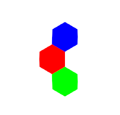
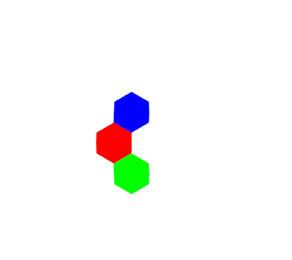
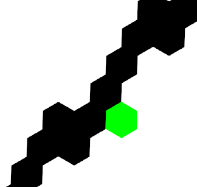

# Paint Program Tutorial

In this multi-part tutorial, we'll talk about how to make a simple MSPaint type program, but one that lets you paint on a tile grid instead of a standard pixel grid. We'll use Sylves to handle all the grid calculations.

You can find a demo illustrating these techniques in action at https://boristhebrave.itch.io/mosaic-paint.

This tutorial will assume some functions only available in Unity, and skips over the parts of the program that don't use Sylves. But the general principles should be  applicable to any program, particularly as Sylves comes with [UnityShim](../extras.md#unityshim) which provides pure C# substitutes for common maths features of Unity.

# Basic setup

I'll list all the imports needed by subsequent parts of code.
```csharp
using Sylves;
using System;
using System.Linq;
using System.Collections.Generic;
using UnityEngine;
```

First we need a variable to define the grid.

```csharp
IGrid grid = new HexGrid(1);
```

We'll start with a hexagon grid of cell size 1. Because we are using the `IGrid` interface, the code will work just as well with any other 2d planar grid supported by Sylves. Note that this grid is infinite in size as we didn't specify any [bounds](../concepts/bounds.md). That won't be a problem for us.

Next we need to define the canvas - i.e. what colors are stored in the grid. As explained in the [concepts](../concepts/storage.md), Sylves doesn't come with any storage classes, you can use your own. We'll just use standard Dictionary.

```csharp
Dictionary<Cell, Color> canvas = new Dictionary<Cell, Color>();
Color defaultColor = Color.white;
Color paintColor = Color.black;
```

We define a default color that is used for cells of the grid that have no entry in canvas, and a paint color that we'll use later.

Let's pre-fill it with some data, so we have something to look at.

```csharp
canvas[new Cell(0, 0, 0)] = Color.red;
canvas[new Cell(1, -1, 0)] = Color.green;
canvas[new Cell(0, 1, -1)] = Color.blue;
```

# Drawing the canvas

To draw the canvas, we need to first determine which cells are visible by the camera, and then draw each of them. 
Because we'll only be drawing visible cells, it doesn't matter that the grid has infinite cells it.

We can find the cells using `GetCellsIntersectsApprox`, which returns all cells intersecting a bounding box.

```csharp
// Determine the visible range of the camera. This code is unity specific
var corners = new[] { new Vector3(0, 0), new Vector3(0, 1), new Vector3(1, 0), new Vector3(1, 1) }
    .Select(camera.ViewportToWorldPoint);
var min = corners.Aggregate(Vector3.Min);
var max = corners.Aggregate(Vector3.Max);
// Flatten the box into the Z=0 plane, which is where the grid is defined.
min.z = max.z = 0;
// Get the cells
var cells = grid.GetCellsIntersectsApprox(min, max).ToList();
```

Next, we can use `GetPolygon` to get the vertices of the cell. The fiddliness of drawing in Unity is omitted here.

```csharp
// Set up an appropriate drawing context. See https://docs.unity3d.com/ScriptReference/GL.html
<omitted>
// Iterate over the cells
foreach (var cell in cells)
{
    // Read the color from the canvas.
    var color = canvas.TryGetValue(cell, out var c) ? c : defaultColor;
    // Read the vertices of the cell. 
    var vertices = grid.GetPolygon(cell);
    // Split up the polygon into triangles, and draw each one of them.
    // (NB: only works for convex polygons)
    GL.Begin(GL.TRIANGLES);
    GL.Color(color.linear);
    for (var i = 2; i < vertices.Length; i++)
    {
        GL.Vertex(vertices[0]);
        GL.Vertex(vertices[i]);
        GL.Vertex(vertices[i - 1]);
    }
    GL.End();
}
```

If successful, you should get an image like:



# Making a pencil tool

A pencil tool simply draws a given color at the mouse cursor. We can use `FindCell` to determine which cell is under the cursor:

```csharp
if (Input.GetMouseButton(0))
{
    // Determines the world position of the cursor.
    // This assumes an orthographic camera that is facing along the Z-axis.
    var p = camera.ScreenToWorldPoint(Input.mousePosition);
    p.z = 0;
    // Find the cell that contains this point
    if (grid.FindCell(p, out var cell))
    {
        // Update canvas
        canvas[cell] = paintColor;
    }
}
```



> [!Note]
> Pencil tools in real paint programs actually draw short lines. This deals with problems of a mouse cursor moving so fast it skips over cells.

# Making a line tool

To draw a line, you need to determine all the cells that intersect a line-segment. Sylves can tell you this with `Raycast`. Raycast can also tell you useful information about the collision, but we won't need that feature.

I'll assume we've already determined the start and end points using some UI code.

```csharp
Vector3 start = new Vector3(-10, -10, 0);
Vector3 end = new Vector3(10, 10, 0);
// Run a raycast between start and end
var raycastHits = grid.Raycast(start, end - start, 1);
// Update canvas
foreach(var raycastHit in raycastHits)
{
    canvas[raycastHit.cell] = paintColor;
}
```




# Making a fill tool

To do a fill tool, we need to do an operation called *flood fill*. This starts at the point the user clicks, and repeatedly searches for neighbours of a similar color. This is easiest done using the `GetNeighbours` function, which returns all cells adjacent to the passed in cell.

```csharp
if (Input.GetMouseButtonDown(0))
{
    // As before with the pencil tool, determine the world position of the cursor.
    var p = camera.ScreenToWorldPoint(Input.mousePosition);
    p.z = 0;
    // Find the cell that contains this point
    if (grid.FindCell(p, out var cell))
    {
        // Do the flood fill algorithm
        // Record the original color, we must match against this.
        var originalColor = canvas[cell];

        // Set up the queue of cells to visit.
        var enqueued = new HashSet<Cell>();
        var toVisit = new Queue<Cell>();
        toVisit.Enqueue(cell);
        enqueued.Add(cell);

        // Visit every cell
        while (toVisit.Count > 0)
        {
            cell = toVisit.Dequeue();
            canvas[cell] = paintColor;
            // For each neighbour
            foreach(var neighbour in grid.GetNeighbours(cell))
            {
                // Does this neighbour also need visiting?
                if (canvas.TryGetValue(cell, out var c) && 
                    c == originalColor &&
                    !enqueued.Contains(neighbour))
                {
                    toVisit.Enqueue(neighbour);
                    enqueued.Add(neighbour);
                }
            }
        }
    }
}
```

> [!Note]
> Flood fills can cause problems on infinite grids. So the above algorithm will ignore any cells that haven't been painted at least once, i.e. cells not in `canvas`.

> [!Note]
> Sylves comes with [pathfinding](../concepts/pathfinding.md) methods like [Pathfinding.FindDistances](xref:Sylves.Pathfinding.FindDistances(Sylves.IGrid,Sylves.Cell,System.Func{Sylves.Cell,System.Boolean},System.Func{Sylves.Step,System.Nullable{System.Single}})) which we could have used here.

# Summary

More tools can be added to the program using other methods of IGrid. For example, `GetCellsIntersectsApprox` and `GetCellCenter` can be used together to find all cells within a given distance of the cursor, making a paint brush tool.

At no point did we write a single line of maths relating to hexagons. That means that the same code would work just as well for a square grid, or the [many other grids](../all_grids.md) that Sylves comes with.

The full program [Mosaic Paint](https://boristhebrave.itch.io/mosaic-paint) includes a number of features not shown in this tutorial. Take a look, and think about how you could achieve them with the [`IGrid`](xref:Sylves.IGrid) api.