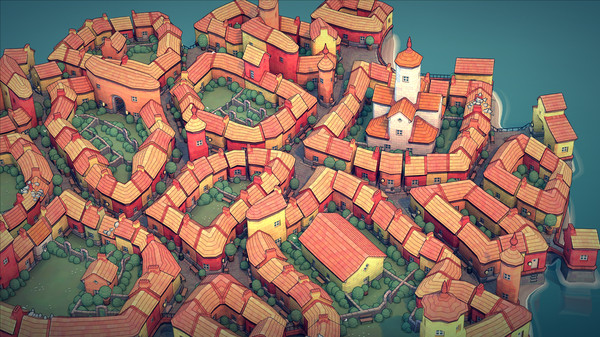

# Townscaper Grid

[Townscaper](https://store.steampowered.com/app/1291340/Townscaper/) is a 2021 developed by Oskar Stålberg. It's a fun town design toy, that stands out because of its unusual flowing grid.



We'll look at creating a similar grid using the tools available in Sylves. The docs on [creating a grid](../creating.md) give more detail on what other options Sylves has.

You can find the [finished code](xref:Sylves.TownscaperGrid) in the Extras folder.

Fortunately, the developer has left detailed discussions for how to create such a grid on Twitter.

## Creating a hex

The townscaper grid is infinite, but it's composed out of small collections of collects in a hexagon shape. First we'll look at creating a single hex.

<blockquote class="twitter-tweet"><p lang="en" dir="ltr">I present: <br>Fairly even irregular quads grid in a hex<br><br>Todo: <br>1. Heuristic to reduce (or eliminate) 6 quad verts<br>2. Tile these babies to infinity <a href="https://t.co/o0kU68uovZ">pic.twitter.com/o0kU68uovZ</a></p>&mdash; Oskar Stålberg (@OskSta) <a href="https://twitter.com/OskSta/status/1147881669350891521?ref_src=twsrc%5Etfw">July 7, 2019</a></blockquote> <script async src="https://platform.twitter.com/widgets.js" charset="utf-8"></script>

This breaks down as:

* Create a hexagon filled with equilateral triangles
* Randomly merge pairs of triangles
* Subdivide everything into quads
* Relax the mesh

Creating a grid of triangles in Sylves is easy, this is a grid library after all.

```csharp
var triangleGrid = new TriangleGrid(0.5f, TriangleOrientation.FlatSides, bound: TriangleBound.Hexagon(4));
```

This creates a grid of triangles with side 0.5, and restricts it to a hexagon that has 4 triangles per side.

TODO: image.

Then, we convert to a mesh. The next steps are then all mesh operations Sylves supplies.

```csharp
var meshData = triangleGrid.ToMeshData();

// Randomly pair the triangles of that grid
meshData = meshData.RandomPairing();

// Split into quads
meshData = ConwayOperators.Ortho(meshData);

// Weld duplicate vertices together (needed for Relax)
meshData = meshData.Weld();

// Smooth the resulting mesh
meshData = meshData.Relax();
```

TODO: images

## Making an infinite grid.

To go from a single hex to an infinite grid, we need to to create a hex grid, and fill each one of the hexes with a mesh generated in the above fashion. Let's turn the above into a function.

```csharp

// The grid of our hexes that need filling with meshes.
// Each hex is 4 from top to bottom, which perfectly matches the size of meshes generated.
HexGrid hexGrid = new HexGrid(4, HexOrientation.PointyTopped);

MeshData GetMeshData(Cell hex)
{
    var triangleGrid = new TriangleGrid(0.5f, TriangleOrientation.FlatSides, bound: TriangleBound.Hexagon(4));
    var meshData = triangleGrid.ToMeshData();
    meshData = Matrix4x4.Translate(hexGrid.GetCellCenter(hex)) * meshData;
    var seed = hex.x + 1000 * hex.y;
    meshData = meshData.RandomPairing(new Random(seed).NextDouble);
    meshData = ConwayOperators.Ortho(meshData);
    meshData = meshData.Weld();
}
```

The key differences are:

* The mesh is translated to the position of the hex we want it to fill.
* The random seed is now fixed based on what hex is being calculated. This ensures the grid is deterministic.
* The mesh is no longer being relaxed. <br/>
  We need the mesh to exactly fill the hex so that we can detect which edges border another hex, and relaxation would get in the way. Relaxation will be handled later instead.

With this function, we can use [PlanarLazyGrid](../grids/planarlazygrid.md), a powerful grid for customization. It takes a mesh function such as the above, and lazily evaluates it to fill the infinite plane as needed. It supports any periodic setup, but we'll use it with a HexGrid specifically.

```csharp
var unrelaxedGrid = new PlanarLazyGrid(GetMeshData, hexGrid);
```

</img>

## Relaxation

Finally, we apply a [relaxation modifier](../modifiers/relaxmodifier.md) to the grid. We couldn't relax each mesh separately as then they wouldn't join up with each other. But the relax modifier works with the entire infinite grid, ensuring a smooth final shape.

```csharp
// While not strictly necessary, we use the same chunk size for relaxation as building the grid
var townscaperGrid = new RelaxModifier(unrelaxedGrid, 4);
```

</img>

## Going 3d

Of course, Townscaper is actually a 3d game. Each cell in the 2d grid extends upwards into a column of 3d cells. Sylves has the [PlanarPrismModifier](../modifiers/planarprismmodifier.md) for doing exactly that.

```csharp
var height = 100;
var options = new PlanarPrismOptions{};
var townscaper3dGrid = new PlanarPrismModifier(townscaperGrid, options, 0, height);
```

TODO: Image

## Enhancements

The above is enough to give an infinite irregular grid of quads with a nice organic look. The actual Townscaper grid is actually a bit more sophisticated:

* Sometimes a hex will randomly decide to use a different mesh generator instead, adding variety to the map
* [It uses a slightly more efficient relaxation regime](https://twitter.com/osksta/status/1151770831619534848)
* [The relaxation rule encourages squarish cell shapes](https://twitter.com/OskSta/status/1169940644669861888)