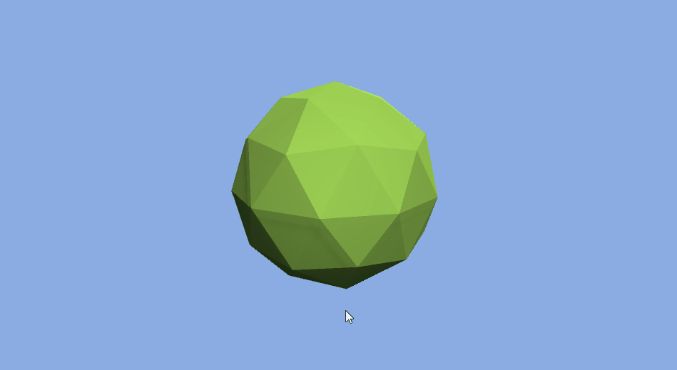
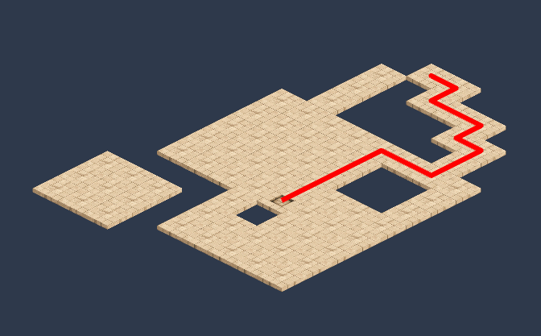
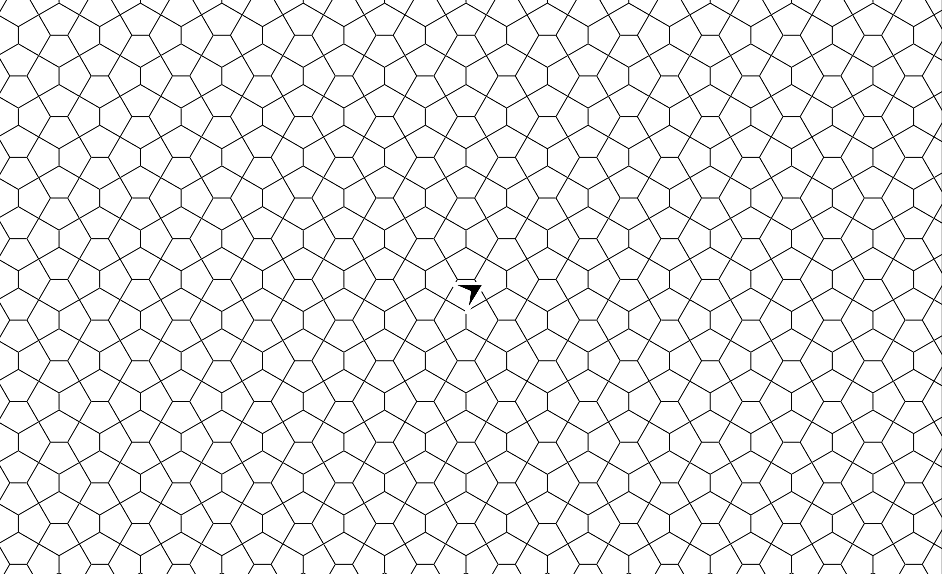

  

    <h1 class="display-4">Sylves v0.1</h1>
    
Handles the maths and algorithms of the geometry of grids

    <small class="text-muted"><a class="github-link" href="https://github.com/BorisTheBrave/sylves">View in Github</a><small>
    

    
Designed to support as many grids as possible, for as many use cases

    

      <a class="btn btn-primary btl-lg" href="articles/index.md" role="button">Getting Started</a>
      <a class="btn btn-primary btl-lg" href="https://github.com/BorisTheBrave/sylves/releases" role="button">Download Latest</a>
      <a class="btn btn-primary btl-lg" href="https://boristhebrave.itch.io/sylves-demos" role="button">Try a demo</a>
      <a class="btn btn-primary btl-lg" href="articles/release_notes.md" role="button">Release Notes</a>
    

  

  

    

      <section>
        <h2>C# Library usable from Unity or .NET</h2>
        

      </section>
    

  

  

    

      
      

        <!-- Indicators -->
        <ol class="carousel-indicators">
          <li data-target="#carousel" data-slide-to="0" class="active"></li>
          <li data-target="#carousel" data-slide-to="1"></li>
          <li data-target="#carousel" data-slide-to="2"></li>
          <li data-target="#carousel" data-slide-to="3"></li>
          <li data-target="#carousel" data-slide-to="4"></li>
          <li data-target="#carousel" data-slide-to="5"></li>
        </ol>
        <!-- Wrapper for slides -->
        

          

            
          

          

            
          

          

            
          

          

            
          

          

            
          

        

        <!-- Controls -->
        <a class="left carousel-control" data-target="#carousel" role="button" data-slide="prev">
          
          Previous
        </a>
        <a class="right carousel-control" data-target="#carousel" role="button" data-slide="next">
          
          Next
        </a>
      

    

  

  

    

      <section>
        <h2>Features</h2>
            <h3>Sylves supports a <a href="articles/grids/index.md">wide range of different grids</a> and you can <a href="articles/creating.md">create</a> even more.</h3>
            <h3>All grids in Sylves shares a common interface, <a href="articles/concepts/index.md">IGrid</a>, so algorithms can be written once and work on any grid. </h3>
            <h3>Sylves handles many of the fiddlier grid operations, such as <a href="articles/concepts/query.md">raycasts</a> and <a href="articles/concepts/pathfinding.md">pathfinding</a>.</h3>
            <h3>Sylves comes with a sophisticated notion of direction and <a href="articles/concepts/rotation.md">rotation<a/></h3>
            <h3>Sylves supports <a href="articles/concepts/shape.md#deformation">mesh deformation</a> to squeeze meshes to fit irregular polygons.</h3>
      </section>
    

  

